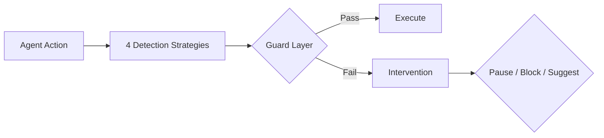

# LoopBuster 🛑

> Break the infinite loops of your AI Agents. Stop burning tokens on dead-ends.

[](https://github.com/liuchunwei732-cmyk/loopbuster/actions/workflows/ci.yml)
[](https://python.org)
[](LICENSE)
[](https://pypi.org/project/loopbuster/)

## 架构



## 检测策略

| 策略 | 原理 | 误报率 |
|---|---|---|
| ExactRepeat | 完全相同的 (tool, args) 重复 | 低 |
| FuzzyRepeat | 基于编辑距离的近似匹配 | 中 |
| CycleDetection | A→B→C→A 模式识别 | 低 |
| OutputStagnation | 输出不随输入变化 | 中高 |

## 快速开始

```bash
pip install loopbuster
from loopbuster import LoopBuster

buster = LoopBuster(
    similarity_threshold=0.85,
    budget_usd=5.0
)

decision = buster.check(tool="search", args={"query": "python"})
if decision.is_loop:
    print(f"🛑 循环检测: {decision.reason}")
```

## 设计决策
* **为什么用 Strategy 模式？** — 每种检测算法独立成类，用户可以自由组合，符合开闭原则。
* **为什么零依赖？** — 保持轻量，用户不想为了一个工具安装一堆库。
* **为什么用 ContextVar？** — 支持 async 上下文隔离，threading.local 在协程下会串数据。
* **为什么 check() 返回 Decision 对象？** — 调用方决定怎么处理，中间件只检测不控制。

## Benchmark

| 指标 | 结果 |
|---|---|
| 测试场景数 | 10 |
| 精确率 | 100% |
| 召回率 | 100% |
| 误报数 | 0 |

## License
MIT
