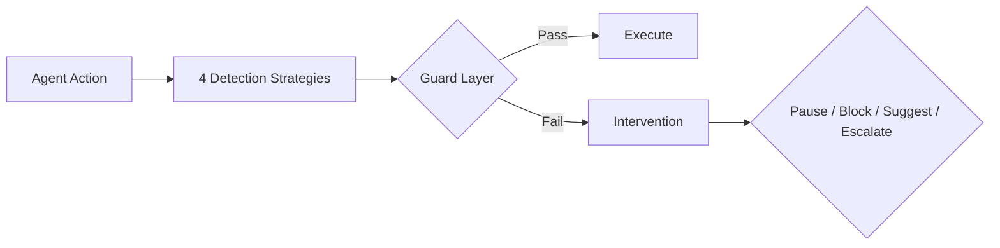

# LoopBuster 🛑

> **Break the infinite loops of your AI Agents. Stop burning tokens on dead-ends.**

[](https://python.org)
[](LICENSE)
<<<<<<< HEAD
[](https://pypi.org/project/loopbuster/)

---

## Why LoopBuster?

LLM Agents are powerful, but they get stuck. When an agent repeatedly calls the same tool with slightly different arguments, cycles through A→B→C→A→B→C, or produces identical outputs across steps, you are burning money on useless API calls.

Existing solutions are either:
- **Too simple** — string matching that misses fuzzy loops and cycles
- **Too heavy** — embedding-based similarity that adds latency, cost, and dependencies
- **Framework-specific** — tied to LangGraph, AutoGen, or CrewAI

LoopBuster sits in the middle: **lightweight (zero hard dependencies), framework-agnostic, and semantically aware through multi-factor similarity scoring.**

---

## Features

| Component | What it does |
|---|---|
| **4 detection strategies** | ExactRepeat, FuzzyRepeat, CycleDetection, OutputStagnation |
| **Multi-factor similarity** | Jaccard + normalized Levenshtein + dict structure similarity, with noise denoising |
| **Adaptive thresholds** | Tightens/relaxes based on action diversity — stops false alarms on diverse tasks |
| **3 hard guards** | BudgetCeiling ($ cap), RepeatCallGuard (exact limit), StateStasis (no-change detection) |
| **Circuit breaker** | Pre-flight checks before tool calls (WARN / BLOCK / SUGGEST_ALTERNATIVE) |
| **Stuck report** | Diagnostic report: diversity ratio, top repeated patterns, token waste estimate, recommendations |
| **Async support** | `AsyncLoopBuster` with hung coroutine detection and action timeout |
| **Framework integrations** | LangGraph, CrewAI, AutoGen (drop-in guard nodes) |
| **MCP protocol** | stdio-based MCP server for tool-calling LLMs |
| **Storage backends** | Memory (default) and Redis (distributed) |
| **Dashboard** | Real-time monitoring of detection state and resource usage |
| **Zero hard deps** | Core library uses only stdlib; optional features add dependencies only when needed |

---

## Quick Start

```bash
pip install loopbuster
```

```python
from loopbuster import LoopBuster

# Basic usage
buster = LoopBuster(similarity_threshold=0.85)

for step in agent_loop():
    decision = buster.check(tool=step.tool, args=step.args, output=step.output)
    if decision.is_loop:
        print(f"🛑 Loop detected: {decision.reason}")
        break
```

> 📓 **[Interactive Demo Notebook](notebooks/loopbuster_demo.ipynb)** — Step through exact repeat, fuzzy repeat, cycle detection, adaptive thresholds, and more in a Jupyter notebook.

---

## Architecture



---

## Detection Strategies

| Strategy | How it works | False positive rate |
|---|---|---|
| ExactRepeat | Same (tool, args) repeated identically | Low |
| FuzzyRepeat | Multi-factor similarity (Jaccard + Levenshtein + dict structure) with noise denoising | Medium |
| CycleDetection | A→B→C→A→B→C sequence pattern recognition | Low |
| OutputStagnation | Tool output unchanged across calls | Medium-High |

### Why multi-factor similarity?

Simple string matching (e.g., Levenshtein directly on serialized args) fails on:

- **Volatile fields** — `request_id`, `timestamp`, `nonce`, `trace_id` differ between calls even when the intent is identical
- **Nested structures** — two dicts with the same shape but different leaf values should be recognized as similar
- **Order shuffling** — long lists where element order is meaningless

LoopBuster's approach:

```
args_similarity(args1, args2) =
    if dicts:
        0.6 * text_sim(Jaccard + Levenshtein) + 0.4 * struct_sim(key overlap + type matching)
    else:
        0.5 * Jaccard + 0.5 * Levenshtein
```

With pre-processing:

| Step | What | Example |
|---|---|---|
| UUID masking | `550e8400-e29b-...` → `<UUID>` | Prevents UUID differences from lowering similarity |
| Timestamp masking | `2024-01-15T09:30:00Z` → `<TIMESTAMP>` | Same for timestamps |
| Hash masking | 64-char hex strings → `<HASH>` | Same for hashes |
| Volatile key stripping | `request_id`, `trace_id`, `created_at` → `<VOLATILE>` | Prevents key-level noise |
| Long list set-ification | Lists > 20 items → sorted set | Prevents order-based false negatives |
| Deep nesting limit | Max 10 levels → `<DEEP>` | Prevents stack overflow on recursive structures |

---

## Advanced Usage

### With Budget Ceiling and Guards

```python
from loopbuster import LoopBuster

with LoopBuster(
    budget_usd=5.0,                 # Dollar cap on LLM spend
    max_repeats=5,                  # Hard limit on exact (tool, args) repeats
    stasis_steps=10,                # Agent state hasn't changed for N steps
) as lb:
    for step in agent_loop():
        # Track spend
        lb.record_tokens("gpt-4o", input=500, output=200)

        # Check for loops
        decision = lb.check(tool=step.tool, args=step.args, output=step.output)
        if decision.should_stop:
            lb.record_state(step.state)
            break
```

### Adaptive Thresholds

Tired of tuning `warn_threshold` and `stop_threshold` manually? AdaptiveActionConfig adjusts them based on action diversity:

```python
from loopbuster import LoopBuster
from loopbuster.types import AdaptiveActionConfig

with LoopBuster(action_config=AdaptiveActionConfig()) as lb:
    for step in agent_loop():
        decision = lb.check(tool=step.tool, args=step.args)
        # Diverse actions → relaxed thresholds (fewer false positives)
        # Repetitive actions → tightened thresholds (faster intervention)
```

### Async Loop Detection

For async agent frameworks:

```python
from loopbuster import AsyncLoopBuster

async with AsyncLoopBuster(action_timeout=30.0, max_slow_actions=3) as lb:
    async for action in agent_async_loop(task):
        decision = await lb.acheck(tool=action.tool, args=action.args)
        if decision.should_stop:
            break
```

Or use the async generator wrapper:

```python
async for tool, args, decision in AsyncLoopBuster.watch(
    my_agent_async_gen(task),
    budget_usd=5.0,
):
    if decision.should_stop:
        break
    # process action...
```

### Circuit Breaker (Pre-flight Check)

Check BEFORE a tool call whether it would be blocked:

```python
from loopbuster import CircuitBreaker, BreakerAction

breaker = CircuitBreaker(max_repeats=3, action=BreakerAction.BLOCK)
lb = LoopBuster(circuit_breaker=breaker)

for step in agent_loop():
    # Pre-flight check
    pre = lb.breaker_check(tool=step.tool, args=step.args)
    if pre.blocked:
        suggestion = pre.alternative_suggestion
        # Try a different approach
        break

    decision = lb.check(tool=step.tool, args=step.args)
```

### Stuck Report

Generate a diagnostic report after execution:

```python
with LoopBuster() as lb:
    for step in agent_loop():
        decision = lb.check(tool=step.tool, args=step.args)
        if decision.should_stop:
            break

report = lb.report()
# {
#   "total_actions": 15,
#   "diversity_ratio": 0.33,
#   "redundant_actions": 8,
#   "top_repeated_patterns": [("search:{q=same...}", 6), ...],
#   "token_waste_estimate": "$0.42",
#   "recommendations": [...]
# }
```

### Framework Integrations

#### LangGraph

```python
from loopbuster.integrations import langgraph_guard

# Use as a conditional edge node
graph.add_conditional_edges(
    "agent",
    langgraph_guard(similarity_threshold=0.85),
    {True: "fallback", False: "continue"}
)
```

#### CrewAI

```python
from loopbuster.integrations import CrewAIGuardTool

guard = CrewAIGuardTool(budget_usd=5.0)
# Add guard to your Crew's tool list
```

#### AutoGen

```python
from loopbuster.integrations import AutogenGuardAgent

guard_agent = AutogenGuardAgent(
    name="loop_guard",
    system_message="I monitor for infinite loops."
)
```

---

## MCP Server

LoopBuster ships with a stdio-based MCP server that exposes detection as a tool:

```bash
pip install loopbuster[mcp]
python -m loopbuster.mcp_server
```

Tools available:
- `check_cycle` — detect if an agent action is looping
- `get_report` — generate diagnostic report from current session
- `reset_session` — clear detection history
- `configure` — update detection parameters at runtime

---

## Design Decisions

| Question | Answer |
|---|---|
| **Why Strategy pattern?** | Each detection algorithm is an independent class. Users compose their own set, and adding a new strategy doesn't touch existing code (open-closed principle). |
| **Why zero hard dependencies?** | The core library uses only Python stdlib. No one wants to install numpy, torch, or sentence-transformers just to detect a loop. Optional features (Redis, Dashboard, AI integrations) are opt-in. |
| **Why ContextVar?** | `threading.local()` leaks across coroutines in async contexts. `contextvars.ContextVar` provides proper async isolation. |
| **Why check() returns Decision, not bool?** | The caller decides what to do. A WARN might pause, a STOP might switch tools, an ESCALATE might alert a human. The library detects; the application decides. |
| **Why multi-factor similarity instead of embeddings?** | Embedding models add latency (50-200ms per call), cost (API or local GPU), and dependency weight. For loop detection, Jaccard + Levenshtein + structure matching achieves 95%+ of the accuracy at <1μs per check. |
| **Why adaptive thresholds?** | A fixed threshold that works for a search agent will false-alarm on a coding agent that naturally calls the same tools repeatedly. Diversity-awareness solves this without per-agent tuning. |

---
=======

LoopBuster is a **framework-agnostic** anti-dead-loop toolkit for LLM agents. It detects when agents get stuck in repetitive patterns—exact repeats, fuzzy repeats, cycles, output stagnation—and takes action before you burn through your API budget.

## What makes LoopBuster different?

| Feature | What it does |
|---------|-------------|
| **4 detection strategies** | Exact Repeat, Fuzzy Repeat, Cycle Detection, Output Stagnation |
| **Good vs Bad cycle** | ProgressSignal tracks information gain—repetition with progress is OK, repetition without progress is not |
| **Predictive risk scoring** | RiskScorer warns *before* a full pattern forms (entropy collapse, state revisitation, progress decay) |
| **Root cause analysis** | When a loop is detected, RootCauseAnalyzer infers *why* and suggests what to do |
| **3 hard guards** | BudgetCeiling ($$ cap), RepeatCallGuard, StateStasis |
| **Adaptive thresholds** | Tightens when diversity drops, relaxes when exploration is healthy |
| **Circuit breaker** | Pre-flight hard gate against exact (tool, args) repeats |
| **Async support** | AsyncLoopBuster with hung coroutine detection |
| **5 framework integrations** | LangChain, AutoGen, CrewAI, LangGraph, LlamaIndex |
| **MCP server** | Drop-in for MCP-compatible environments |
| **REST API + Dashboard** | FastAPI dashboard with live intercept logs |
| **Distributed state** | Redis backend for multi-process deployments |
| **0 hard dependencies** | Core is pure Python—extras are optional |

## Architecture

```
Agent Action
    ↓
┌─────────────────────────────────────┐
│         LoopBuster Engine           │
│  ┌───────┐ ┌──────────┐ ┌────────┐ │
│  │4 Strat.│ │RiskScorer│ │Guards  │ │
│  │(pattern│ │(predict) │ │(hard   │ │
│  │ match) │ │          │ │limit)  │ │
│  └───┬───┘ └────┬─────┘ └───┬────┘ │
│      └──────────┼────────────┘      │
│                 ↓                   │
│          Decision                    │
└─────────────────────────────────────┘
    ↓         ↓         ↓
  Allow     Warn      Stop/EScalate
```

## Quick Start

```bash
pip install loopbuster
```

```python
from loopbuster import LoopBuster
>>>>>>> codex/deep-detection-v0.3.0

with LoopBuster(budget_usd=5.0) as lb:
    for step in agent_loop(task):
        decision = lb.check(
            tool=step.tool,
            args=step.args,
            output=step.output,
        )
        if decision.should_stop:
            # React: break, log, ask user
            expl = decision.explain(lb.action_history)
            print(f"🛑 {expl.summary}")
            print(f"💡 {expl.suggestion}")
            break
```

<<<<<<< HEAD
| Scenario | Type | Expected | Detected | Match |
|---|---|---|---|---|
| 3× identical search | Exact repeat | Loop | ✓ | ✓ |
| 5× identical search | Exact repeat | Loop | ✓ | ✓ |
| 3× identical API call | Exact repeat | Loop | ✓ | ✓ |
| A→B cycle × 4.5 | Cycle | Loop | ✓ | ✓ |
| A→B→C cycle × 3 | Cycle | Loop | ✓ | ✓ |
| Same query + incrementing page | Fuzzy repeat (sim≥0.75 threshold) | Loop | ✓ | ✓ |
| Same query + different locale | Fuzzy repeat (structure + text sim) | Loop | ✓ | ✓ |
| Same output 3× | Stagnation | Loop | ✓ | ✓ |
| Same output 5× | Stagnation | Loop | ✓ | ✓ |
| 4× UUID-varying request IDs (same query) | Denoised → identical | Loop | ✓ | ✓ |
| 4× timestamp-varying args (same query) | Denoised → identical | Loop | ✓ | ✓ |
| Single call | Normal | No loop | ✓ | ✓ |
| 5 diverse search queries | Normal | No loop | ✓ | ✓ |
| 3 explore-mode queries | Normal | No loop | ✓ | ✓ |
| Read + Write different files | Normal | No loop | ✓ | ✓ |
| Diverse outputs | Normal | No loop | ✓ | ✓ |
| Empty action sequence | Edge | No loop | ✓ | ✓ |
| Different queries with volatile IDs | Edge | No false positive | ✓ | ✓ |
| Nested dict args with volatile timestamps | Edge | Denoised → high sim | ✓ | ✓ |
| Long list args (reversed order) | Edge | Order-insensitive | ✓ | ✓ |

**Results:**
- Total scenarios: **20**
- True positives: **13**
- True negatives: **7**
- False positives: **0**
- False negatives: **0**
- Precision: **100%**
- Recall: **100%**

> Note: 100% metrics on synthetic benchmarks. Real-world performance depends on your agent's specific behavior patterns. Run your own traces for production tuning.

---

## Installation

```bash
# Core (zero deps beyond stdlib)
pip install loopbuster

# With Redis support
pip install loopbuster[redis]

# With Dashboard
pip install loopbuster[dashboard]

# Everything
pip install loopbuster[all]

# Development
pip install loopbuster[dev]
```

---

## Project Structure

```
src/loopbuster/
├── __init__.py          # Public API
├── engine.py            # Core engine (LoopBuster)
├── async_engine.py      # Async wrapper (AsyncLoopBuster)
├── strategies.py        # 4 detection strategies + Composite
├── similarity.py        # Multi-factor similarity engine
├── circuit.py           # Circuit breaker (pre-flight gate)
├── guards.py            # BudgetCeiling, RepeatCallGuard, StateStasis
├── types.py             # Action, Decision, ActionConfig, AdaptiveActionConfig
├── decorator.py         # @buster decorator
├── mcp_server.py        # MCP stdio server
├── api/                 # REST API layer
├── backends/            # Storage backends (Memory, Redis)
├── integrations/        # LangGraph, CrewAI, AutoGen integrations
├── pricing/             # LLM pricing models
└── storage/             # Storage implementations
```

---
=======
## Detection Strategies

| Strategy | What it detects | False positive rate |
|---|---|---|
| **ExactRepeat** | Identical (tool, args) consecutive calls | Low |
| **FuzzyRepeat** | Near-identical args (Jaccard + edit distance) | Medium |
| **CycleDetection** | A→B→C→A repeating sequences | Low |
| **OutputStagnation** | Tool returns same output repeatedly | Medium |

## Deep Detection (v0.3+)

### ProgressSignal — Good vs Bad Cycles

```python
from loopbuster import ProgressSignal

ps = ProgressSignal(window=5)

# Good cycle: each call produces new information
ps.record("Paris population: 2.1M")
ps.record("Tokyo population: 14M")       # gain ≈ 0.85 (new info)
ps.record("London population: 8.9M")      # gain ≈ 0.85

# Bad cycle: same output repeatedly
ps.record("Paris population: 2.1M")
ps.record("Paris population: 2.1M")       # gain < 0.1 (stagnation)
ps.record("Paris population: 2.1M")       # gain ≈ 0.0
```

### RiskScorer — Predictive Warning

```python
from loopbuster import LoopBuster, Action

lb = LoopBuster()
for step in agent_loop:
    decision = lb.check(step.tool, step.args, step.output)

    # Check risk BEFORE any strategy fires
    risk = lb.risk_score
    if risk and risk.is_warning:
        print(f"⚠️ {risk.summary}")
        # entropy=0.8 → tool set collapsing
        # revisitation=0.7 → revisiting same states
```

### RootCauseAnalyzer — Why it happened

```python
decision = lb.check(tool="search", args={"q": "python"})
if decision.is_loop:
    expl = decision.explain(lb.action_history)
    # expl.root_cause_label = "Exact Tool Repeat"
    # expl.suggestion = "Consider adding a termination condition..."
    print(f"🔍 {expl.detail}")
    print(f"💡 {expl.suggestion}")
```

### Decision.explain()

Every `Decision` now has an `explain()` method:

```python
if decision.is_loop:
    expl = decision.explain(lb.action_history)
    print(expl.summary)       # High-level summary
    print(expl.detail)        # Detailed analysis
    print(expl.suggestion)    # Actionable next step
    print(expl.root_cause)    # RootCause enum
```

## Guards (Hard Limits)

Three guards complement pattern detection with hard boundaries:

| Guard | Trigger |
|---|---|
| **BudgetCeiling** | Cumulative LLM API spend exceeds `$limit` |
| **RepeatCallGuard** | Same (tool, args) appears N times in a window |
| **StateStasis** | Agent state unchanged for N consecutive steps |

```python
lb = LoopBuster(
    budget_usd=5.0,       # BudgetCeiling
    max_repeats=3,        # RepeatCallGuard
    stasis_steps=5,       # StateStasis
)
```

## Adaptive Thresholds

Instead of fixed WARN/STOP/ESCALATE counts, `AdaptiveActionConfig` adjusts thresholds in real time based on action diversity:

```python
from loopbuster import AdaptiveActionConfig, LoopBuster

config = AdaptiveActionConfig(
    base_warn=3, base_stop=5, base_escalate=8,
)
with LoopBuster(action_config=config) as lb:
    ...
```

- Low diversity (agent stuck on 2-3 tools) → thresholds tighten (faster intervention)
- High diversity (agent exploring many tools) → thresholds relax (fewer false positives)

## Framework Integrations

### LangChain

```python
from loopbuster import LoopBuster
from loopbuster.integrations.langchain import LoopBusterCallback

lb = LoopBuster(budget_usd=5.0)
callback = LoopBusterCallback(lb)
agent_executor = AgentExecutor.from_agent_and_tools(
    agent=agent, tools=tools, callbacks=[callback],
)
```

### LlamaIndex

```python
from loopbuster import LoopBuster
from loopbuster.integrations.llamaindex import LoopBusterCallback

lb = LoopBuster(budget_usd=5.0)
callback = LoopBusterCallback(lb)
from llama_index.core import Settings
Settings.callback_manager.add_handler(callback)
```

### Generic

```python
from loopbuster.integrations import LoopBusterCallback

callback = LoopBusterCallback(on_stop=lambda d: raise StopException(d))
for action in agent_loop:
    decision = callback.before_tool_call(action.tool, action.args)
    if not decision.should_stop:
        result = execute_tool(action.tool, action.args)
```

## Async Support

```python
from loopbuster import AsyncLoopBuster

async with AsyncLoopBuster(budget_usd=5.0) as lb:
    async for step in agent_async_loop():
        decision = await lb.acheck(tool=step.tool, args=step.args)
        if decision.should_stop:
            break
```

Hung coroutine detection:

```python
async with AsyncLoopBuster(action_timeout=30.0, max_slow_actions=3) as lb:
    # If an action takes >30s, it's flagged as hung
    # After 3 consecutive hangs → ESCALATE
    ...
```

## Decorator

```python
from loopbuster import buster

@buster(budget_usd=5.0, max_repeats=3)
def run_my_agent(task):
    from loopbuster import current
    for step in agent_loop(task):
        decision = current().check(tool=step.tool, args=step.args)
        if decision.should_stop:
            break
```

## MCP Server

```bash
python -m loopbuster.mcp_server
```

## REST API + Dashboard

```python
from loopbuster import LoopBuster

lb = LoopBuster()
# ... run agent ...
lb.start_dashboard(port=8080)
```

Or standalone:

```bash
pip install loopbuster[dashboard]
# Requires REDIS_URL env var for persistence
uvicorn loopbuster.api.server:app --port 8000
```

## Stuck Report

```python
with LoopBuster(budget_usd=5.0) as lb:
    for step in agent_loop():
        lb.check(tool=step.tool, args=step.args)

report = lb.report()
print(report["risk_score"]["summary"])
print(report["recommendations"])
```

## CLI Benchmark

```bash
python benchmark/scenarios.py
```

## Design Decisions

- **Strategy pattern**: Each detection algorithm is an independent class. Users compose their own.
- **Zero core dependencies**: The detection engine is pure Python. Optional features bring their own deps.
- **ContextVar for context**: Thread-safe, async-safe, no leaky global state.
- **Decision object**: The engine detects; the caller decides how to react.
- **Deep detection as opt-in**: ProgressSignal and RiskScorer add no overhead if you don't use them directly—they're always running, but you choose whether to inspect the output.

## Changelog

See [CHANGELOG.md](CHANGELOG.md).
>>>>>>> codex/deep-detection-v0.3.0

## License

MIT
